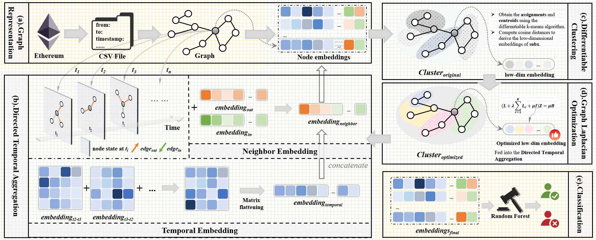

# Ethereum Fraud Detection: Dit-SGCR

This is an implementation of the papaer - 'DiT-SGCR: Directed Temporal Structural Representation with Global-Cluster Awareness for Ethereum Malicious Account Detection'

## Overview

The detection of malicious accounts on Ethereum - the preeminent DeFi platform - is critical for protecting digital assets and maintaining trust in decentralized finance. Recent advances highlight that temporal transaction evolution reveals more attack signatures than static graphs. However, current methods either fail to model continuous transaction dynamics or incur high computational costs that limit scalability to large-scale transaction networks. Furthermore, current methods fail to consider two higher-order behavioral fingerprints: (1) direction in temporal transaction flows, which encodes money movement trajectories, and (2) account clustering, which reveals coordinated behavior of organized malicious collectives. To address these challenges, we propose DiT-SGCR, an unsupervised graph encoder for malicious account detection. Specifically, DiT-SGCR employs directional temporal aggregation to capture dynamic account interactions, coupled with differentiable clustering and graph Laplacian regularization to generate high-quality, low-dimensional embeddings. Our approach simultaneously encodes directional temporal dynamics, global topology, and cluster-specific behavioral patterns, thereby enhancing the discriminability and robustness of account representations. Furthermore, DiT-SGCR  bypasses conventional graph propagation mechanisms, yielding significant scalability advantages. Extensive experiments on three datasets demonstrate that DiT-SGCR consistently outperforms state-of-the-art methods across all benchmarks, achieving F1-score improvements ranging from 3.62% to 10.83%

## Architecture of the DiT-SGCR



## Requirements

- Python
- numpy
- pandas
- scikit-learn
- scipy
- pytorch

## Dtaset

We evaluated the performance of the model using two publicly available and newly released datasets.

1. MulDiGraph: https://xblock.pro/#/dataset/13
2. BE4: https://github.com/git-disl/BERT4ETH
3. TransactionsNetwork:https://drive.google.com/file/d/1pCJm4TKuf-Wv8QSBOdwiBdariGEJWIvC/view?usp=drive_link

## Usage

**Step1** Create environment and install required packages.

**Step2** Download the dataset and process the data into a usable format.

**Step3** Generate node embeddings

```
python dit_sgcr.py --dataset B4E
python dit_sgcr.py --dataset MulDiGraph
```

**Step4** Detect malicious accounts

```
python detect_rf.py --dataset B4E
python detect_rf.py --dataset MulDiGraph
```

